<p align="center">
  
</p>

<p align="center">
  <strong>Dreamy browser experience — floating panda vibes, soft visuals, and playful interaction.</strong>
</p>

<p align="center">
  <a href="https://dacameragirl.github.io/floating-panda-dream/"></a>
  <a href="https://github.com/DaCameraGirl/floating-panda-dream"></a>
</p>

<p align="center">
  
  
</p>

### Languages

<p align="center">
  
  
</p>

### Stack

<p align="center">
  
  
</p>

<p align="center">
  Built by <strong>Angela Hudson</strong> · <a href="https://github.com/DaCameraGirl">DaCameraGirl</a>
</p>
# 🐼✨ Floating Panda Dream

<p align="center">
  
</p>

A bright arcade sky-run where you guide a floating panda through a crowded dream lane, collect glowing charms, chain lantern rings, pop hazards with sparkly darts, and chase a higher dream score before the timer runs out.

🎮 **Play now:** https://dacameragirl.github.io/floating-panda-dream/

<p align="center"></p>
<p align="center"></p>


### 🌐 GitHub Pages Browser Game

The live Pages version is the feature-forward game. It is a static browser game powered by `index.html`, `styles.css`, and `game.js`:

- 🐼 Floating panda character
- 🖱️ Mouse steering: hold/click the playfield and guide the panda
- 📱 Touch steering and on-screen mobile controls
- ⌨️ Keyboard controls
- ⚡ Dash move
- ✨ Sparkly dart shooter
- 🔊 Browser-made sound effects
- 🌠 Brighter panda trails, dart trails, burst effects, and layered sky scenery
- 🏆 Local best score tracking
- 🌅 Dream rank HUD that climbs as your score grows
- 🍬 Moon candy
- ⭐ Star fruit
- 🌙 Moon pearls
- 💎 Prism gems
- 🪷 Lotus blooms
- 🪁 Dream kites
- ☄️ Comet crumbs
- 🫧 Dream bubbles
- ⏰ Time charms
- 🪽 Dash feathers
- 🧲 Star magnets that pull good objects closer
- 🔔 Lullaby bells that clear nearby hazards
- 🏮 Lantern rings
- 🌩️ Storm bolts
- 💤 Sleepy pillows
- 👻 Ghost clouds
- 🌀 Thorn spirals
- 🌑 Eclipse shards
- 🪢 Gravity knots

### 🐍 Panda3D Python Reference

The repo also keeps the original local Panda3D version in `src/`. That version runs as a desktop Python game, but it is simpler and does not match every browser feature.

<p align="center"></p>
<p align="center"></p>


### Browser / GitHub Pages

- 🖱️ **Mouse:** hold/click the game area to steer toward the pointer and auto-fire sparkly darts
- 🖱️ **Double-click:** dash
- 📱 **Touch:** hold the screen to steer, or use the on-screen buttons
- ⌨️ **WASD / Arrow keys:** move
- ⚡ **Space:** dash
- ✨ **F / Enter:** shoot sparkly darts

### Python / Panda3D

- ⌨️ `WASD` or arrow keys: float around
- ⚡ `Space`: short dash
- 🔁 `R`: restart
- 🚪 `Esc`: quit

<p align="center"></p>
<p align="center"></p>


| Language | Where | What It Does |
| --- | --- | --- |
| 🌐 **HTML** | `index.html` | Browser game structure for GitHub Pages |
| 🎨 **CSS** | `styles.css` | Neon styling, HUD, overlays, touch controls |
| 🟨 **JavaScript** | `game.js` | Canvas game loop, physics, collisions, input, scoring, sounds, object variety |
| 🐍 **Python** | `src/` | Simpler Panda3D desktop reference |
| 📦 **Requirements text** | `requirements.txt` | Python dependency list for the Panda3D version |

The browser game is split into HTML, CSS, and JavaScript files so GitHub can detect each language more clearly.

<p align="center"></p>
<p align="center"></p>


### 🌐 Browser Version

Open `index.html` in a modern browser, or serve the folder locally:

```bash
python -m http.server 8000
```

Then open:

```text
http://localhost:8000
```

### 🐍 Panda3D Version

```bash
pip install -r requirements.txt
python src/main.py
```

<p align="center"></p>
<p align="center"></p>


Score as high as possible before time runs out:

- 🍬 Collect goodies for points
- 🏮 Chain lantern rings to build streaks
- 🫧 Use dream bubbles for protection
- ⏰ Grab time charms to extend the run
- ⚡ Use dash feathers and Space/double-click dashes to escape danger
- 🧲 Grab star magnets to pull nearby goodies inward
- 🔔 Trigger lullaby bells to clear nearby hazards
- ✨ Shoot sparkly darts to pop hazards from a distance
- 🌩️ Avoid hazards that drain energy, slow movement, or break streaks

<p align="center"></p>
<p align="center"></p>


```text
.
├── index.html          # GitHub Pages browser shell
├── styles.css          # Neon game styling
├── game.js             # Browser game logic, sounds, and controls
├── manifest.webmanifest
├── sw.js               # Offline cache for the browser game
├── docs/               # Design notes
├── src/                # Panda3D Python game
├── requirements.txt    # Python dependencies
├── README.md
└── LICENSE
```

<p align="center"></p>
<p align="center"></p>


The browser game is the best version for GitHub Pages because it runs completely in the browser with no server. The Python/Panda3D version is still useful as a local desktop reference, but the browser version is the richer version of the game.

<p align="center"></p>
<p align="center"></p>


Player-facing change notes live in [`docs/UPDATES.md`](docs/UPDATES.md).